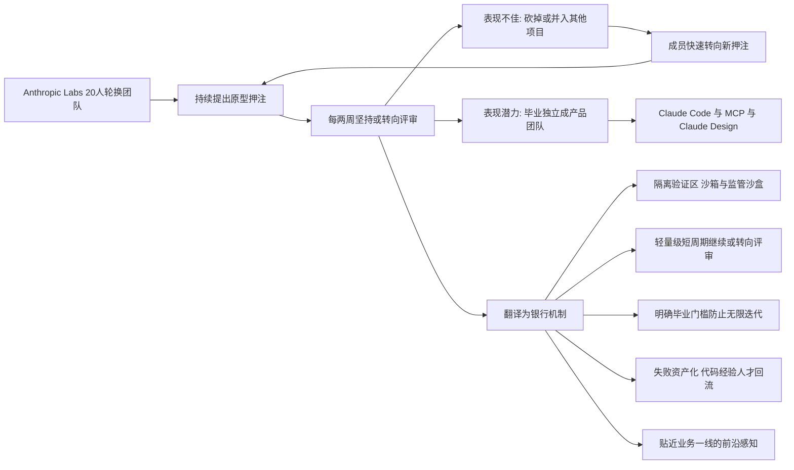

# 让失败常态化的创新机器：Anthropic Labs"两周淘汰70%项目"机制，金融业科技开发能不能学？

## 核心摘要

- **20人Labs团队以两周为周期评审押注**
- **七成项目被砍反而孵化出核心产品**
- **机制内核可搬但形式参数不可照搬**
- **银行需把高淘汰翻译成隔离验证区**

## 引言：一支"注定失败"的团队，却做出了最赚钱的产品

2026年9月，一则关于 Anthropic 的报道在技术与产品圈刷屏：这家公司内部有一支不足20人的 Labs 团队，项目每两周接受一次"坚持还是转向"评审，约70%至80%的"押注"最终都会被砍掉——而恰恰是这支"失败团队"，孵化出了 Claude Code、模型上下文协议（MCP）、Claude Design 这些 Anthropic 最核心的产品。

对科技行业而言，这套机制是"快速试错"的教科书；但把它放到金融业面前，问题立刻变得棘手。银行业科技开发的底色是长周期、重合规、强审计、追责文化——在这样的组织里，"鼓励失败""两周砍项目"几乎是反直觉甚至反纪律的。那么，这套机制对金融业、银行业到底有没有借鉴意义？能借鉴到什么程度？本文先核实机制的真实细节，再逐层论证：**什么内核可搬，什么形式不可照搬，以及如何翻译成银行能用的语言。**

## 一、机制核实：Anthropic Labs 到底怎么运作

在讨论"能不能借鉴"之前，先确保我们讨论的是真实存在的机制，而非被夸大的段子。据 Business Insider 对 Anthropic 联合创始人、Labs 负责人 Ben Mann 的专访，以及多个交叉来源，关键事实如下：

**其一，定位是"内部创业孵化器"，默认失败。** Labs 约2024年成立，规模不足20人，成员采用轮换制，持续提出新的产品原型，内部称为"押注"（bets）。Ben Mann 直言："我们确实将其视为真正意义上的创业孵化器，并预期大多数押注会以失败告终。"据他估计，Labs 内部创意的成功率只有约20%至30%——换言之，70%至80%的押注注定失败。**关键在于：失败不是意外，而是默认值。**

**其二，两周一轮"坚持还是转向"评审。** 项目每隔约两周接受一次评审：表现不佳的被直接砍掉或并入其他项目，成员随即转向新尝试；表现出的潜力被验证的项目则从 Labs"毕业"，独立组建产品团队。据透露，一个项目通常只要团队规模增长到超过4人，就会毕业离开 Labs。正是这种"随时可凋零、随时可长大"的高流动性，让20人的团队始终处于快速新陈代谢状态。

**其三，Claude Code 是最典型的成功样本。** Mann 最初把任务交给刚入职的工程师 Boris Cherny，后者一开始想做的是代码分析工具，但 Mann 认为方向不够大胆，要求他做更大。2024年底，Labs 通过贴近模型研发前沿的优势，预判到即将发布的新模型在 agentic coding（智能体编程）上表现突出，随即推动 Cherny 把代码分析概念放大为 Claude Code——2025年2月以内部预览发布，随后成为 Anthropic 商业化最成功的产品之一。

**其四，它不是凭空发明的，而是一种被反复验证的组织学。** 该模式参考了 Bell Labs，以及 Google 早期的 Area 120 和 X 的"登月工厂"（Moonshot Factory）。Anthropic Labs 的特殊之处在于：它离前沿模型研究足够近，能在能力变化的第一时间思考"这些新能力能做成什么产品"。

一句话总结这套机制的内核：**用极低的试错成本规模化快速地尝试、无情地淘汰、迅速地放大，让失败者的人、代码与经验立即回流到下一批押注。**

## 二、为什么这套机制对银行"反直觉"：先看清冲突

要回答"能不能借鉴"，先得承认银行业科技开发的运行环境与 Anthropic 有本质差异。这些差异不是借口，而是硬约束：

**约束一：业务性质不同。** Anthropic 的押注失败，损失的是原型开发成本；银行的科技项目一旦上线，牵涉客户存款、交易、隐私与底层系统稳定。创新可以失败，但**不能让客户承担失败**——这是银行创新的第一红线，也是金融监管的底线。

**约束二：治理节奏不同。** 银行科技项目的立项要过预算与业务审批，变更要过变更管理委员会，上线要过安全与合规评审，外部采购要过招投标流程，外包开发受外包风险管理规定约束。一个"两周砍掉 70%"的机制，如果原样搬进生产域，意味着合规评审、审计链和监管报备全部失控。

**约束三：组织与文化不同。** 银行普遍存在明显的部门墙与责任制：项目立项后，投入的资源、采购的合同、承诺的 KPI 都带有"沉没成本"色彩，"砍项目"往往意味着追责、丢面子甚至绩效考核受损。在 "staging 出问题要写事故报告" 的文化里，"砍掉项目"很难被正常化为一种能力，而容易被解读为"当初立项就是错的"。

**约束四：人的激励不同。** Anthropic Labs 轮换制下，成员因为项目被砍而转投新项目是一种荣誉性的流动性；而银行科技人员往往以"守好自己的一亩三分地"为安全策略，项目被砍对个人职业路径的打击是实打实的。

所以，直白的结论是：**把"两周淘汰70%"这套参数原样搬进银行，是错误的，甚至是有害的。** 但这不等于这套机制对银行毫无价值。真正值得问的是：把它剥去外壳后，内核里有哪些东西，是银行可以且应该学的？

## 三、能借鉴的内核：五个"可搬运"的底层逻辑

**内核一：把"失败额度"预算化，而不是把"失败"定罪化。** Labs 最值钱的做法，不是淘汰率高，而是**从上到下默认一部分资源就是用来失败的**。银行完全可以设定一个创新预算池（例如科技投入的一定比例），明确用于高风险、高不确定的早期押注，并让立项书里就写明"本项目的预期失败率"。一旦失败，纳入既定成本，而不是当作事故考核。**这改变了创新的财务语义。**

**内核二：用"短周期、小规模"代替"长周期、大而全"。** 银行创新失败的最大原因之一，是喜欢一上来就做"平台级""全行级"项目，周期以年计，资源以十亿计，一旦方向错误，沉没成本巨大。Labs 的反面示范是：**用几周时间、几个人、最小可用产品（MVP）去验证一个假设**，验证通过再追加资源。这个逻辑银行完全适用——把它做成"先打样、后扩建"，而不是"一步到位"。

**内核三：轻量级"继续或转向"评审嵌入治理。** 银行不需要照搬"两周"这个数字，但可以把关键的立项评审与阶段门（milestone gate）缩短、前移、并行化：把"一年后验收"改成"每四到六周做一次数据驱动的继续或转向决策"。评审的输入应该是真实的客户反馈与使用数据，而不是汇报PPT。**治理的目的从"把关放行"变成"频密纠偏"。**

**内核四：为验证区设立清晰的"毕业门槛"，防止僵尸项目。** Labs "超过4人就毕业"的规则本质是：**一旦一个押注开始需要更多资源，就进入正式管理与放大的轨道，不能在孵化期无限消耗。** 银行可以对应地定义"从验证区进入生产区的硬条件"（如隐私合规达标、性能达标、客户价值指标达标、通过安全评审），达不到就永不毕业。这一条能直接对抗银行最常见的"僵尸系统"——系统上线后没人用、但也永不关闭。

**内核五：让创新单元贴近"银行业务的前沿能力"。** Labs 的优势在于离模型研究近。银行的"前沿"不是研究所，而是**业务一线与客户触点**——反欺诈的新信号、信贷审批的新数据、客服的新交互方式。银行可以建立"驻场式"创新小组，让工程师直接长在业务场景里，第一时间感知"新能力（包括大模型Agent能力）能解决什么业务问题"，这与 Labs 提前感知 agentic coding 能力是同一逻辑。

## 四、不可照搬的边界：哪些必须被银行改造

**边界一：淘汰率不能直接复制。** 70%到80%的淘汰率适用于"零客户暴露"的原型押注。银行即便在隔离验证区，只要有客户数据、监管场景参与，就必须把淘汰节奏与合规评审对齐。现实的做法是把"高淘汰"放在**不接触真实客户、不进入生产链路的原型阶段**，一旦进入客户触点，成功率门槛就要显著提高。

**边界二：不能把快速迭代引入核心系统。** 核心账务、支付清算、风控规则引擎这类系统的变更，永远要走严谨的变更与回滚流程。Labs 机制只适用于**创新孵化区**，绝不等同于"整个银行科技都改成两周迭代"。

**边界三："鼓励失败"不能变成"纵容不负责"。** 银行可以对失败免责，但前提是：如实记录失败原因、做过真实验证、有数据支撑结论。**免责的是"科学试错的失败"，而不免责"未经验证就上线的过失"。**

**边界四：债务与合规成本不能被"快"消解。** 供应商采购、外包备案、个人金融信息保护、审计留痕，这些硬成本是银行创新的真实税负——借鉴 Labs 机制不意味着绕开它们，而是**把更多创新放到合规成本低、隔离程度高的新型态里（如监管沙盒、创新实验区）**，让"快"发生在制度允许的通道内，而不是制度的裂缝里。

## 五、银行落地路径：把"高淘汰"翻译成"隔离验证区"

综合以上，金融业真正可执行的，不是复制一套"失败团队"，而是搭建一个**由三分结构组成的创新漏斗**：

| 层级 | 定位 | 节奏与规则 | 失败处理 |
| --- | --- | --- | --- |
| 原型层（隔离实验区） | 6至10人小分队，对接监管沙盒 | 4至6周一评审，允许大比例淘汰 | 代码入库沉淀为"可复用零件"，成员回流创新池 |
| 验证层（试点区） | 引入真实但受限的业务与客户场景 | 里程碑化"继续或转向"，成功率门槛上移 | 达标者进入生产，不达标者关闭并留档 |
| 生产放大层（正式渠道） | 全行级交付，走标准开发与合规流程 | 常规治理，不适用高淘汰机制 | 严格变更管理与后评估 |

这套结构的关键，是把 Anthropic 的"两周淘汰"基因**降速、隔离、加闸门**后，保留其灵魂：**低成本的快速探索 + 数据驱动的无情纠偏 + 失败资产的复用。** 银行不必让20个人砍掉70%的项目，但可以让每一个有潜力的新想法，都经历"小、快、可证伪、可安全关闭"的验证跑通一遍——这本身就是把"被砍"从一个贬义词，改写成一种创新的制度化能力。

## 六、结语：能借鉴的不是淘汰率，而是"让创新可以随时安全失败"

回到最初的问题：Anthropic Labs 这套机制，金融业银行业能不能借鉴？

**能借鉴，但借鉴的是机制内核，不是形式参数。** 70%的淘汰率、两周的节奏、20人的规模，都是 Anthropic 在其"高自由、低合规、产品驱动"环境下找出的最优解；银行不能、也不应照抄这些数字。但机制背后的五个底层逻辑——失败预算化、短周期小规模验证、轻量级纠偏评审、毕业门槛防僵尸、贴近业务前沿——**完全可以用隔离验证区的形式，翻译成银行自己的语言**。

这场翻译的本质，是让银行在"稳健"与"创新"之间找到一种新的平衡：**不是降低稳健去迁就创新，而是把创新小心翼翼地装进一个可以被安全失败、可以被量化评估、可以被随时关闭的容器里。** 当一家银行能做到"让创新单元可以安全地失败"，它就已经学会了 Labs 机制最珍贵的那一课——而这一课，与它的业务是银行还是AI公司无关。

## FAQ

**Q1：Anthropic Labs 的机制是真实存在的吗？**
真实。依据是 Business Insider 对 Anthropic 联合创始人、Labs 负责人 Ben Mann 的专访，并获多个来源交叉印证：约20人轮换团队、每两周"坚持还是转向"评审、成功率约20%至30%（即70%至80%押注被砍）、项目超4人就毕业，Claude Code/MCP/Claude Design 均出自 Labs 或经其早期孵化。

**Q2：银行能不能直接照搬"两周砍掉70%项目"？**
不能。银行科技项目涉及客户资金、隐私与系统稳定，且受合规、审计、采购、外包等硬约束；直接把高淘汰率搬进生产域会导致合规失控。可借鉴的是机制内核（失败预算化、短周期验证、轻量级纠偏、毕业防僵尸、贴近业务前沿），并以隔离验证区的形式落地。

**Q3：银行在哪里可以实践这套机制？**
在原型/隔离实验区——建议对接监管沙盒，使用脱敏数据，不接触真实生产链路。小规模、短周期验证，达标后按门禁进入试点与生产。生成式AI与Agent创新尤其适合这种先行验证模式。

**Q4：银行"鼓励失败"会不会变成"纵容不负责"？**
关键在于免责边界：免责的是"有数据支撑、如实记录的科学试错"，不免责"未经验证就上线的过失"。银行应把失败原因、验证过程留档，让失败成为可复用的知识资产，而非含糊的追责对象。

**Q5：这套机制对银行最直接的落地收益是什么？**
对抗银行最常见的三大创新顽疾：立项即长期、上线即僵尸、失败即追责。通过短周期验证降低沉没成本，通过毕业门槛防止僵尸系统，通过失败免责让人才与代码回流，最终把"被砍"从风险变成一种可管理的常态能力。

---

**事实来源说明**：本文机制事实基于 Business Insider 对 Anthropic 联合创始人 Ben Mann 的专访，并经新浪财经、腾讯新闻（编译褚杏娟）等媒体交叉核实；补充背景参考 Google Area 120 与 X Moonshot Factory 的公开资料。所有判断、借鉴论证与落地建议为作者基于机制的合理推演，不构成对 Anthropic 或任何银行的管理建议。外部网页信息仅作素材与事实参考，不代表本站立场。

*作者毕超，金融行业风险管理从业者。本文仅代表作者个人观点，不构成任何投资或管理建议。*
*（内容由AI生成，仅供参考）*
