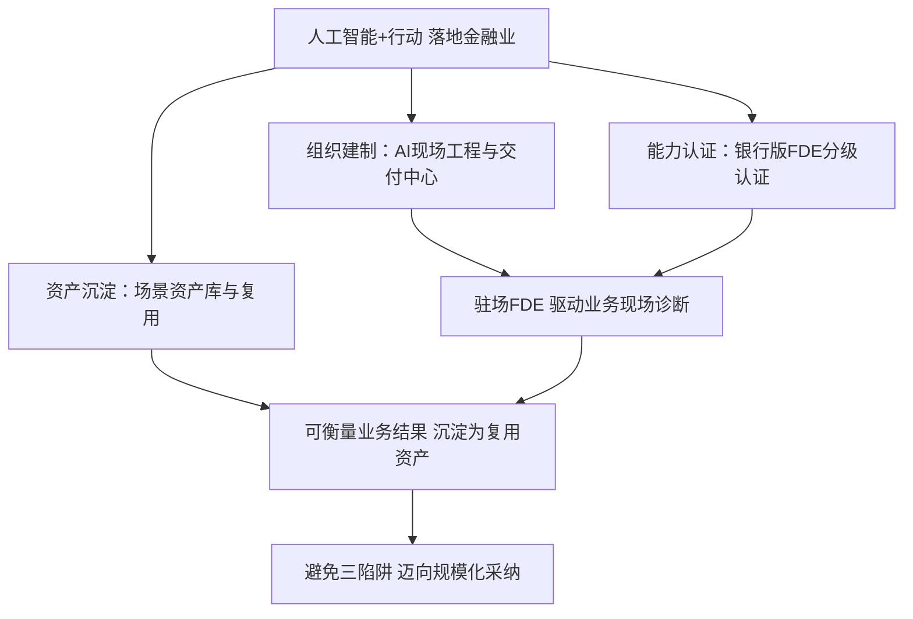

# 中国金融业实施"人工智能+"行动如何打造与用好FDE——从埃森哲千人FDE队伍的启示

## 核心摘要

- **埃森哲建千人FDE折射智能体交付竞争新逻辑**
- **中国金融业缺的不是模型而是驻场工程力**
- **人工智能+落地关键是培育银行版现场工程师**
- **建制造与用机制要双向发力缺一不可**

## 引言：一则新闻里的"交付范式"信号

2026年9月8日，埃森哲（Accenture）与Google Cloud联合宣布成立 **Accenture Gemini Enterprise Business Group**，目标是帮助客户在"智能体AI时代"规模化落地 Gemini Enterprise。多数解读聚焦于"两大巨头深化绑定"的商业层面，但这条新闻真正值得中国金融业关注的，是它的一个建制细节：**该业务集团将专门建立一支 1000 人的 forward deployed engineer（FDE，前向部署工程师）队伍**，作为交付智能体AI的现场工程底座。

这不是埃森哲第一次配置FDE类岗位，但把它提升为"一个千人规模、与能力中心并列、横跨四大优先领域的正式业务集团"，动作规格完全不同。它意味着：**当模型与平台日益商品化，全球头部服务商的竞争壁垒，已经从"谁的模型强"迁移到"谁能派出足够多的现场工程师，在企业真实环境里把智能体变成可衡量的业务结果"。**

对中国金融业来说，这面镜子照出的问题更直接：**"人工智能+"行动落地金融场景，真正卡脖子的环节往往不是模型与算法的选择，而是缺少一支能驻场、懂业务、能把通用模型改造成可治理金融系统的工程队伍。** 本文以这则新闻为引子，先拆解其建制逻辑，再落到中国金融业"如何打造"与"如何用好"FDE 两条主线上。

## 一、埃森哲这则发布到底讲了什么

把新闻稿拆开，可以看到一个清晰的"交付范式"：

| 要素 | 新闻稿内容 | 反映的行业逻辑 |
| --- | --- | --- |
| 组织形态 | 成立 Accenture Gemini Enterprise Business Group，隶属 Accenture Google Business Group | 用"业务集团"这种正式建制，把AI交付团队固化下来，而非临时项目组 |
| 人力底座 | 建立 1000 人 FDE 队伍，叠加近 5 万名 Google Cloud 技能员工 | 用规模化现场工程师应对"从单元级试点到企业级再造"的全部旅程 |
| 能力支撑 | Gemini Enterprise 认证专业人才 + 行业与职能经验 + 专项加速器与实施框架、行业化可复用方案、专属能力中心 | 把"方法论、可复用资产、人才认证"三位一体，降低时间价值比（time-to-value） |
| 四大优先领域 | ① 加速 Gemini Enterprise 采用；② 构建可复用行业方案；③ 弥合实验与规模化的能力中心；④ 驱动规模化用户采纳 | 覆盖"引入—方案—工程—运营"的完整采用生命周期 |
| 验证案例 | YouTube 在 NFL Sunday Ticket 高峰期间部署 Gemini Enterprise Agent，客户情感提升11%、平均处理时长下降37% | 用可量化业务指标（情感、处理时长）证明智能体在峰值场景下的价值 |

新闻稿里的两个细节尤其值得注意：

**第一，"Bridging the gap between AI experimentation and enterprise-scale transformation"（弥合AI实验与企业级规模化转型之间的鸿沟）被单列为四大优先领域之一。** 这几乎是对行业痛点的直接承认——实验（Demo）很多，真正跑进生产的很少。FDE 队伍正是为填这个鸿沟而生的。

**第二，FDE 与"可复用资产"捆绑。** 埃森哲明确要做"purpose-built for Gemini Enterprise deployment"的专有加速器与实施框架，而非一次性外包。这意味着 FDE 的价值不是"驻场写代码"，而是"把现场经验沉淀为可复用资产，再复制到下一个客户"——这正是智塔迭代中，中国银行业内部最缺的资产化能力。

## 二、中国金融业"人工智能+"行动为什么需要FDE

### 2.1 "人工智能+"行动不只是换模型，更是换工程方式

"人工智能+"行动（国家层面推动的以应用促发展的专项行动）落到金融业，核心不是"上几个大模型"，而是**将AI嵌入信贷、风控、运营、合规、财富管理等真实业务流程，形成可持续的生产力**。这要求的不只是算法能力，而是端到端的工程落地能力：

- **业务侧**：要把信贷审批、反洗钱、监管报送等复杂流程拆解为可被智能体执行的子任务；
- **数据侧**：先盘清口径、质量、可得性，再谈模型——这与埃森哲强调的"可复用行业方案"异曲同工；
- **治理侧**：金融AI必须可审计、可问责、数据可用不可见，这比任何行业都更严格。

前两篇关于 FDE 的分析（德勤Open Model Engineering视角、Datawhale FDE案例100视角）已经论证过"银行缺的是现场工程力而非算法"。这里补充的关键点是：**"人工智能+"行动是制度性投入，其产出必须可考核、可沉淀。** 而FDE恰是"把行动变成可沉淀资产"的最小组织单元。

### 2.2 中外差距不在人才数量，而在"建制化"

一个常见误读是"埃森哲有1000名FDE，我们也要搞1000人"。实际上：

| 维度 | 埃森哲/Gemini模式 | 中国金融业现状（常见情形） |
| --- | --- | --- |
| 组织位置 | FDE 是正式业务集团的核心编制 | 多散落在科技部门、外包团队、项目组 |
| 能力认证 | Gemini Enterprise 认证 + 专项培训体系 | 认证体系稀缺，能力靠个人经验积累 |
| 资产沉淀 | 加速器、实施框架、行业方案可复用 | 项目交付后资产难以跨部门复制 |
| 考核导向 | 以客户可量化业务结果为导向 | 往往以"交付物"而非"业务结果"考核 |

这说明差距的本质是**制度设计**问题：如何让"现场工程师"成为一个有归属、有认证、有晋升通道、有资产沉淀的正式建制，而非临时借调的"救火队"。

## 三、打造FDE：中国金融业的"三位一体"路径

结合埃森哲的建制逻辑与金融业特殊性，中国金融机构打造FDE可以从三个层面同步推进：

### 3.1 组织建制：成立"现场工程"单元而非虚设岗位

- 建议在总行层面设立 **"AI现场工程与交付中心"**（或先以虚拟团队试验），对标埃森哲将 FDE 从项目组升格为业务集团的逻辑；
- FDE 与行内开发、数据、算法、业务条线形成联动矩阵，但保留独立的"驻场观察—问题反馈—方案交付"职责边界；
- 初期可"核心自建 + 生态共建"：银行自建一支核心 FDE 骨干，同时与头部服务商、科技公司共建"联合现场工程队"，像埃森哲那样把生态力量嵌进交付链路。

### 3.2 能力认证：从"干中学"到"有标准"

- 设立 **银行版 FDE 能力画像**（可参考德勤/Datawhale分析中提炼的维度），明确"懂业务+懂工程+会陪跑+懂合规"的最低认证门槛；
- 建立**分级认证**（初级现场工程师→高级FDE→FDE架构师），并把它纳入职级晋升与薪酬体系，与"认证后优先承接智能化项目"挂钩；
- 用**真实金融场景实战**作为认证核心，而非只考证书：例如让候选人真实完成一个"监管报表辅助Agent"从诊断到上线的全过程。

### 3.3 资产沉淀：让每次交付都能复用

- 推进 **"加速器/实施框架"内化**：每个FDE项目结束后，必须沉淀出"可复用的业务方案模板、数据质量检查清单、提示词/编排资产、评测集"；
- 建设**行内场景资产库**：把跨支行的信贷、反洗钱、报送等场景抽象为"可复用的行业方案"，实现从"项目制"到"资产制"的转变；
- 用**度量指标**驱动：参照 YouTube 案例的"情感提升11%、平均处理时长-37%"，为每个FDE项目预设可量化的业务结果指标（如审批时长、风险识别率、合规差错率），让沉淀有据可依。

## 四、用好FDE：避免"建了建制、用不起来"

打造只是前半场，真正难的在于"用好"。埃森哲把"驱动用户采纳与规模化使用"列为四大重点之一，反证了**"部署了不等于用起来"**是行业共性难题。中国金融业要避免三个陷阱：

**陷阱一：FDE被当普通外包/驻场运维用。** 若只是让FDE去"盯系统、接需求"，其"现场洞察—资产沉淀"价值会归零。正确用法是让FDE拥有现状诊断权与方案建议权，直接对业务结果负责。

**陷阱二：认证与激励脱钩。** 如果认证了FDE却不给职级、薪酬、晋升上的实质差异，队伍会迅速流失或名存实亡。激励要做到"认证即用、用过即考、考过即升"。

**陷阱三：FDE只服务已验证场景。** 应把FDE配置到"最可能出价值也最可能失败"的新场景（如复杂智能体Agent、跨系统流程编排），让现场工程师去啃硬骨头，而不是把资源集中在已经跑通的舒适区。

## 五、结语：从"千人FDE"看中国金融业"人工智能+"的下一程

埃森哲的1000人FDE队伍，本质上是一次关于"AI交付能力资产化"的押注：它赌的是**在模型层商品化之后，现场工程力将成为企业级AI竞争的主战场。** 中国金融业不需要简单拷贝"千人"这个数字，而应拷贝这句话背后的方法论——把"驻场、跨界、可复用"的现场工程力量，建成一个与业务深度耦合、有认证、有激励、有资产沉淀的正式建制。

当"人工智能+"行动的顶层设计已经铺开，接下来考验金融机构的，不是设备与模型买得多不多，而是**有没有一批能走进业务现场、把通用AI改造成可治理金融系统、并把经验沉淀为复用资产的人。** 这，才是"人工智能+"行动落到金融业后最硬的工程底座。

## FAQ

**Q1：埃森哲成立1000人FDE队伍，和普通外包驻场有何不同？**
核心区别在"资产化"与"可复用"：埃森哲的FDE同时隶属于一个正式业务集团，配有认证体系与专项加速器/实施框架，目标是把现场经验沉淀为可复用的行业方案并复制到下一个客户；普通外包驻场通常是"交付物导向、做完即走"，缺乏制度化沉淀。

**Q2：中国中小银行没有条件建1000人FDE，怎么起步？**
无需追求规模。可先建一支"核心骨干FDE + 生态联合"的小型队伍，优先在监管报表辅助、贷后预警归因、对账勾稽等"近、痛、ROI可算"场景跑通闭环；同时建立认证-激励-资产沉淀三件套，把小而精的试点变成可复制的内部方法论。

**Q3：FDE对"人工智能+"行动的落地价值怎么量化？**
建议参考YouTube案例预设可量化指标：如审批平均处理时长下降比例、风险识别率提升、合规差错率降低、智能体任务完成率、人工复核节省工时等；每个FDE项目立项时就定好"业务结果指标"，并在上线后追踪，作为FDE考核与资产入库依据。

**Q4：金融合规严，FDE模式会不会带来数据安全风险？**
金融场景必须坚持"数据可用不可见、推理可溯源、过程可审计"。FDE驻场应配合严格的数据分级、权限白名单、操作留痕与脱敏机制；涉及敏感数据的场景优先私有化/不出域部署，FDE只接触经过脱敏与授权范围内的数据。

**Q5：现有的外包团队能否直接转型为FDE？**
可以，但需升级：外包人员普遍"重交付、轻业务"，转型核心是补足"业务解构能力+模型工程+合规意识"，并通过实战认证（真实完成一个金融场景Agent全流程）才能纳入FDE序列；否则只是换了个叫法。

*作者毕超，金融行业风险管理从业者。本文仅代表作者个人观点，不构成任何机构立场。*
*本文基于外部公开信息与媒体报道（含 Google Cloud Press Corner 于2026年9月8日发布的《Accenture and Google Cloud Deepen Partnership with Formation of New Accenture Gemini Enterprise Business Group》新闻稿，兼引作者此前关于德勤Open Model Engineering与Datawhale FDE案例100的分析）撰写的分析文章，观点以公开信息为准，不构成任何机构建议。*
